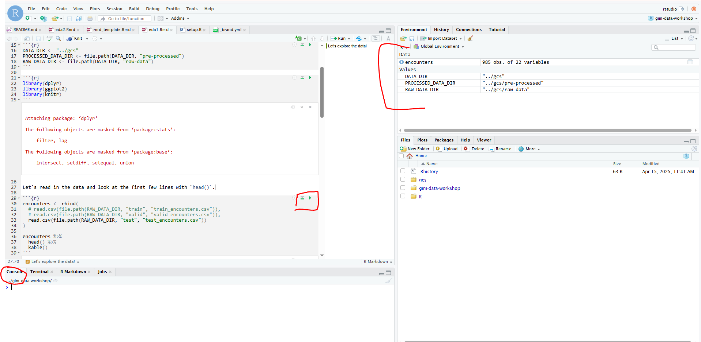

```{r setup, include=FALSE}
knitr::opts_chunk$set(message = FALSE, echo = TRUE, warning = FALSE)
```

# Intro

## Before we get started

-   If you want to follow along with the code:

    -   Log in to the research environment.

    -   Check that you have the required packages.

```{r eval=FALSE, echo = TRUE}
library(dplyr)
library(ggplot2)
# If this works, you can skip the next step!
```

        
- Run the `setup.R` file to install required packages


```{r, eval = FALSE, echo = TRUE}
# Data processing
install.packages(c("dplyr", "ggplot2", "knitr", "tidyr", "DT"))

# Modeling
install.packages(c("tidymodels", "glmnet"))

# Note: this one may take a bit of time
# install.packages(c("xgboost")) 
```

-   The data exploration reports (and slides) were created in [Quarto](https://quarto.org/), which allows me to combine code and markdown.

-   R tips:

    

    -   You can run code directly in the console

    -   Run code line-by-line with Ctrl + Enter

    -   You can also run a chunk of code

-   Python to R:

    -   [`tidyverse`](https://www.tidyverse.org/) is a collection of R packages designed for data science. All packages share an underlying design philosophy, grammar, and data structures.
    
        -   [`dplyr`](https://dplyr.tidyverse.org/) for data processing -\> this is similar to [`pandas`](https://pandas.pydata.org/) or [`polars`](https://pola.rs/)
    
        -   [`ggplot2`](https://ggplot2.tidyverse.org/) for plotting -\> like [`matplotlib`](https://matplotlib.org/) and [`seaborn`](https://seaborn.pydata.org/) but not really... this is most similar to [`plotnine`](https://plotnine.org/)
    
    -   [`tidymodels`](https://www.tidymodels.org/) is a collection of R packages for modeling and machine learning, following the `tidyverse` principles.

         
        -   similar to [`scikit-learn`](https://scikit-learn.org/stable/)


-   Notebooks are built in [`rmarkdown`](https://rmarkdown.rstudio.com/) or [`quarto`](https://quarto.org/) -\> similar to [`jupyter`](https://jupyter.org/)

## Goals for today

-   Get familiar with the GIM dataset

-   Get familiar with data exploration (or, at least, how *I* do data exploration)

## Agenda(ish)

-   until 2:10: intro, logistics
-   until 2:50: exploratory data analysis part 1 (let's try to get through as much as we can: encounters, outcomes, diagnoses, labs and vitals, medications, orders)
-   2:50-3:00: break
-   3:00 - 3:45:  exploratory data analysis part 2 (let's create the patient timeline and maybe a bit of modeling...)
-   3:45 - 4:00: wrap-up, questions

## DSAA

-   Data Science and Advanced Analytics

-   A data-driven group at Unity Health Toronto (UHT) devoted to applying data science, including artificial intelligence (AI), to advance patient care and health system efficiency at UHT.

-   **Mandate**: "To use high quality healthcare data in innovative ways to catalyze communities of data users and decision makers in making transformative changes that improve patient outcomes and healthcare system efficiency"

## GIM dataset

-   In August 2020, we deployed CHARTwatch, an early warning system for detecting patient deterioration.

-   CHARTwatch was deployed to the General Internal Medicine (GIM) ward.

-   The aim of CHARTwatch is to identify patients that are at risk of deterioration:

    -   Transfer to the Intensive Care Unit (ICU)

    -   Death

    -   Transfer to the Palliative Care unit

-   The model was trained on \~20,000 patient visits consisting of: laboratory values, vital measurements, and demographics.

-   The model output is a risk group: **High** vs **Medium** vs **Low** risk group

-   Model predictions are then delivered to different end-users:

    -   Email to charge nurses

    -   Email to the Palliative Care team

    -   Update to front-end tool

    -   Alerts sent to pager

-   [The GIM dataset](https://healthdatanexus.ai/content/smh-gim/1.0.1/) consists of (a version of) the data used to train the CHARTwatch algorithm

    -   Data have been de-identified

    -   Patient identifiers were removed

    -   Any variable containing the year or month was removed from the data, and only elapsed time relative to a patient time zero was retained.

## GIM dataset on HDN

-   Data are split into train, validation, test *based on admission date*

-   Tables:

    -   Static: encounters (a.k.a., visits), demographics

    -   Time-varying: measurement (labs and vitals), clinical orders, medications

    -   See [the data dictionary](https://gim-docudash.netlify.app/docs/) for more information

-   Both raw and pre-processed data are provided

    -   For example, in the processed measurements data, all numeric values have been trimmed to the 1st and 99th quantile, and normalized.

    -   For example, for time-varying data, missing values are imputed with the *last observation carried forward*.

[Add a screenshot or just jump over to the research environment!]

# Let's explore the data!


## Files 

### Static:


| Table           | Raw | Pre-processed |
|-----------------|:---:|:-------------:|
| Encounters      | ✅  | ✅            |
| Baseline Values | ✅  | ✅            |
| Demographics    | ✅  | ✅            |

### Time-varying

| Table                     | Raw | Pre-processed |
|---------------------------|:---:|:-------------:|
| Numeric Values            | ✅  | ✅            |
| Clinical Orders           | ✅  | ✅            |
| Medication Administration | ✅  | ✅            |
| Outcomes                  |     | ✅            |
| Alternate Outcomes        |     | ✅            |

## Read in the data!

**Note**: If you want to be able to run this, update the `DATA_DIR` variable so that it points to the folder where the dataset is saved.

```{r}
DATA_DIR <- "gcs"
PROCESSED_DATA_DIR <- file.path(DATA_DIR, "pre-processed")
RAW_DATA_DIR <- file.path(DATA_DIR, "raw-data")
```

Let's load a few packages:

```{r}
library(dplyr) # for data processing
library(ggplot2) # for plotting
library(knitr) # for rendering nice tables
library(DT) # for rendering nicer tables
```

## Encounters  

### About

The **encounters** table is a static table where each row represents 1 encounter (visit),

Let's read in the encounters data first and look at the first few lines with `head()`.

```{r}
encounters <- rbind(
  # Comment out the lines below if you want to read in all the data!
  # read.csv(file.path(RAW_DATA_DIR, "train", "train_encounters.csv")),
  # read.csv(file.path(RAW_DATA_DIR, "valid", "valid_encounters.csv")),
  read.csv(file.path(RAW_DATA_DIR, "test", "test_encounters.csv"))
)
```

```{r}
encounters %>%
  head() 
```

That was hard to read...

### Exploring the columns of the encounters table

I can use `kable()` from the `knitr` package to display tables nicely in the notebook.

```{r}
encounters %>%
  head() %>%
  # kable() from the knitr package will render a nice table without the icky code bits
  kable()
```

What do any of these columns mean?

-   `ENCOUNTER_NUM` looks like it's an ID...

-   `PATIENT_DK` also looks like it's an ID...

-   What's `FROM_SERVICE_CD`? What's `MRP_DIAGNOSIS`?

Looking at good 'ole counts is my favorite way to get a better understanding of the data.

#### `FROM_SERVICE_CD` column

Let's look at `FROM_SERVICE_CD`

```{r}
encounters %>%
  # count() from the dplyr package will return the counts
  count(FROM_SERVICE_CD, sort = T) %>%
  # Here, I use datatable() from the DT package instead
  datatable()
```

Some observations:

-   `TMA` (Team Medicine A), `TMB` (Team Medicine B), etc. are all General Internal Medicine teams.

-   Main takeaway from looking at these counts: this column describes the service that the patient starts in at the beginning of their encounter.

#### `OUTCOME_TYPE` column

We continue to look at counts. Let's look at the `OUTCOME_TYPE` column.

```{r}
encounters %>%
  count(OUTCOME_TYPE, sort = T) %>%
  kable()
```

Most encounters have the `OUTCOME_TYPE = 5`

From the [data dictionary](https://gim-docudash.netlify.app/docs/datadict/encounters/):

| Column name    | Description                                                                                                          |
|------------------------------------|------------------------------------|
| `OUTCOME_TYPE` | 1 if **ICU Transfer**, 2 if **Death**, 3 if **Palliative entry**, 4 if **Palliative discharge**, 5 if **Discharged** |

### Looking at outcome columns with `gtsummary`

Wait there's a faster way to do this! With `gtsummary`, we can create a nice summary table.

```{r}
# library(gtsummary)
# encounters %>%
#   tbl_summary(include = c(
#     age, gender, 
#     pre_gim_icu, post_gim_icu, 
#     OUTCOME_ALL, OUTCOME_TYPE
#   )
# )
```

From the data dictionary:

| Column name     | Description                                                                                                          |
|------------------------------------|------------------------------------|
| `ICD10`         | ICD code of the Most Responsible Diagnosis                                                                           |
| `MRP_DIAGNOSIS` | Most responsible diagnosis                                                                                           |
| `age`           | Patient age at time of admission                                                                                     |
| `pre_gim_icu`   | Flag for patient having been in the ICU prior to GIM entry                                                           |
| `post_gim_icu`  | Flag for patient entering ICU after GIM                                                                              |
| `OUTCOME_TYPE`  | 1 if **ICU Transfer**, 2 if **Death**, 3 if **Palliative entry**, 4 if **Palliative discharge**, 5 if **Discharged** |
| `OUTCOME_ALL`   | 1 if OUTCOME_TYPE is 1, 2, 3, or 4; 0 if OUTCOME_TYPE is 5                                                           |

### Diagnoses 

Let's look at diagnoses:

| Column name     | Description                                |
|-----------------|--------------------------------------------|
| `ICD10`         | ICD code of the Most Responsible Diagnosis |
| `MRP_DIAGNOSIS` | Most responsible diagnosis                 |

```{r}
encounters %>%
  select(MRP_DIAGNOSIS, ICD10) %>%
  count(MRP_DIAGNOSIS, ICD10, sort = T) %>%
  mutate(rate = n / sum(n)) %>%
  datatable()
```

There are a LOT of diagnosis codes. I highlight a few below[^1] 

[^1]: codes pulled from [here](https://icd.who.int/browse10/2019/en)

-   `I`: Diseases of the circulatory system

    -   `I50`: Heart failure

    -   `I63`: Cerebral infarction

-   `J`: Diseases of the respiratory system

    -   `J44`: Other chronic obstructive pulmonary disease

    -   `J18`: Pneumonia
    
**Exercise**: Extract the first letter of the ICD10 and look at counts!

### What unit are the patients transferring from?

| Column name | Description                                      |
|-------------|--------------------------------------------------|
| `FROM_UNIT` | The unit where the patient was transferred from. |

Lots of patients transferred from the ED

```{r}
# encounters %>%
#   tbl_summary(
#     include = c(FROM_UNIT),
#     sort = all_categorical(FALSE) ~ "frequency"
#   )
```

### Time to outcome

| Column name      | Description                                                                                                                                                                                       |
|-----------------------------------|-------------------------------------|
| `OUTCOME_TYPE`   | 1 if **ICU Transfer**, 2 if **Death**, 3 if **Palliative entry**, 4 if **Palliative discharge**, 5 if **Discharged**                                                                              |
| `OUTCOME_ALL`    | 1 if OUTCOME_TYPE is 1, 2, 3, or 4; 0 if OUTCOME_TYPE is 5                                                                                                                                        |
| `ccc`            | Flag indicating if comfort care order was placed                                                                                                                                                  |
| `outcome_no_ccc` | OUTCOME_TYPE except where (death == 1 and ccc == 1 and OUTCOME_TYPE == 2), then `outcome_no_ccc` = 3. Deaths that are "expected" (based on comfort care order) are grouped with palliative entry. |
| `gim_to_outcome` | Time from GIM entry to outcome in **days**.                                                                                                                                                       |
| `time_to_event`  | Time from GIM entry to outcome in **hours**.                                                                                                                                                      |

```{r}
# encounters %>%
#   tbl_summary(include = c(post_gim_icu, OUTCOME_ALL, OUTCOME_TYPE, outcome_no_ccc))
```


####

Other interesting variables to look at are the time-to-event outcomes: `time_to_event`, `gim_to_outcome`

```{r}
encounters %>%
  select(OUTCOME_ALL, OUTCOME_TYPE, time_to_event, gim_to_outcome) %>%
  head() %>%
  kable()
```

####

Let's plot the data!


```{r}
encounters %>%
  ggplot(aes(x = time_to_event, y = OUTCOME_TYPE, fill = as.factor(OUTCOME_TYPE))) +
  geom_boxplot() +
  labs(
    title = "Time to event by outcome type",
    x = "Time from GIM entry to event (hours)",
    y = "Outcome type",
    caption = "1 = ICU transfer, 2 = Death, 3 = Palliative entry, 4 = Palliative discharge, 5 = Discharged",
    fill = "Outcome type"
  ) +
  theme_minimal() +
  scale_fill_brewer(type = "div") +
  theme(legend.position = "top")
```

####

A boxplot is great for summarizing the data, but some information still gets "hidden".

We can add the actual data points back to the plot.

Note: `ggplot2` makes it easy to build plots by following the [grammar of graphics](https://ggplot2-book.org/). Graphs are composed by combining independent components.

```{r}
#| code-line-numbers: "4"
encounters %>%
  ggplot(aes(x = time_to_event, y = OUTCOME_TYPE, fill = as.factor(OUTCOME_TYPE))) +
  geom_boxplot() +
  geom_jitter(alpha = 0.3) +
  labs(
    title = "Time to event by outcome type",
    x = "Time from GIM entry to event (hours)",
    y = "Outcome type",
    caption = "1 = ICU transfer, 2 = Death, 3 = Palliative entry, 4 = Palliative discharge, 5 = Discharged",
    fill = "Outcome type"
  ) +
  theme_minimal() +
  scale_fill_brewer(type = "div") +
  theme(legend.position = "top")

```

####

Another alternative: the violinplot provides additional details on the distribution.

```{r}
encounters %>%
  ggplot(aes(x = time_to_event, y = OUTCOME_TYPE, fill = as.factor(OUTCOME_TYPE))) +
  geom_violin() +
  labs(
    title = "Time to event by outcome type",
    x = "Time from GIM entry to event (hours)",
    y = "Outcome type",
    caption = "1 = ICU transfer, 2 = Death, 3 = Palliative entry, 4 = Palliative discharge, 5 = Discharged",
    fill = "Outcome type"
  ) +
  theme_minimal() +
  scale_fill_brewer(type = "div") +
  theme(legend.position = "top")
```

####


This looks super interesting... Let's look at the actual numbers

```{r}
# encounters %>%
#   tbl_summary(
#   # Stratify with the 'by' argument
#     by = "OUTCOME_TYPE",
#     include = c(time_to_event, gim_to_outcome),
#     label = list(
#       time_to_event ~ "Time to outcome (hours)",
#       gim_to_outcome ~ "Time to outcome (days)"
#     )
#   ) %>%
#   # gtsummary lets you add features to the table
#   add_overall() %>%
#   # To modify tbl_summary object, it must be converted to a gt object
#   as_gt() %>%
#   gt::tab_source_note(
#     "1 = ICU transfer, 2 = Death, 3 = Palliative entry, 4 = Palliative discharge, 5 = Discharged"
#   )
```

####

Takeaways:

-   The average patient will spend 5 days in the hospital

-   Patients who die or go to palliative spend a lot more time

-   (But also recall that our discharged patients have a very long tail in the boxplot)

## Labs and vitals  

### About

The `*_numeric_variables` files contain the measure and the time the measure was recorded (in hours since admission).

Let's explore!

```{r}
measurements <- rbind(
  # read.csv(file.path(RAW_DATA_DIR, "train", "train_numeric_variables.csv")),
  # read.csv(file.path(RAW_DATA_DIR, "valid", "valid_numeric_variables.csv")),
  read.csv(file.path(RAW_DATA_DIR, "test", "test_numeric_variables.csv"))
)

measurements %>%
  head() %>%
  kable()
```

### `variable` column

The `variable` column seems important.

```{r}
measurements %>%
  count(variable, sort = T) %>%
  head(20) %>%
  kable()
```

### Vitals

Let's focus on vitals.

```{r}
vitals <- measurements %>%
  filter(
    variable %in% c("vital_sbpdiastolic", "vital_sbpsystolic", 
                    "vital_sfio2", "vital_s02saturation", 
                    "vital_spulse", "vital_srespirations", 
                    "vital_stemperature"))
```

```{r}
vitals_summary <- vitals %>%
  group_by(variable) %>%
  summarize(
    n = n(),
    median = median(numeric_value),
    q01 = quantile(numeric_value, probs = 0.01),
    q25 = quantile(numeric_value, probs = 0.25),
    q75 = quantile(numeric_value, probs = 0.75),
    q99 = quantile(numeric_value, probs = 0.99),
    min = min(numeric_value),
    max = max(numeric_value)
  )
vitals_summary %>%
  kable()
```

There are some pretty crazy values...

### Vital measurements and time

There doesn't really seem to be a relationship between weird values and the time they're measured.

```{r}
vitals %>%
  filter(variable == "vital_stemperature") %>%
  ggplot(aes(x = time, y = numeric_value)) +
  geom_point() +
  labs(
    title = "Is there a relationship between the temperature values and the time they're measured?",
    x = "Time of measurement (hours)",
    y = "Temperature (C)"
  ) +
  theme_minimal()
```

-   Behavior seems kind of random. Why is this happening?

-   Could be data entry error (wrong decimal or maybe wrong units or both)

### Temperature plots

Continuing to look at temperature...

```{r}
vitals %>%
  filter(variable == "vital_stemperature") %>%
  ggplot(aes(x = numeric_value)) +
  geom_histogram() +
  labs(
    title = "Histogram",
    x = "Temperature (C)",
    y = "Count"
  ) + 
  theme_minimal()
```

### Temperature - filtering

Let's get rid of a few rows...

```{r}
vitals %>%
  filter(variable == "vital_stemperature") %>%
  filter(numeric_value >= 34.8 & numeric_value <= 38.4) %>%
  ggplot(aes(x = numeric_value)) +
  geom_histogram() +
  labs(
    title = "Histogram (trimmed)",
    x = "Temperature (C)",
    y = "Count",
    caption = "Much better!"
  ) +
  theme_minimal()
```

### Temperature - trimming

Okay, so let's trim our vitals to the 1st and 99th quantile

```{r}
vitals %>%
  ggplot(aes(x = numeric_value, fill = variable)) +
  # Use facet_wrap to split up the plots by a variable
  facet_wrap(. ~ variable, scales = "free") +
  geom_histogram() +
  labs(
    title = "Vital measurements",
    x = "Numeric value",
    y = "Count"
  ) + 
  theme_minimal()

```

```{r}
vitals %>%
  # Join to the summary dataframe and get rid of 
  # values less than q01 or greater than q99
  left_join(vitals_summary, by = "variable") %>%
  mutate(trimmed_value = case_when(numeric_value <= q01 ~ q01,
                                   numeric_value >= q99 ~ q99,
                                   TRUE ~ numeric_value)) %>%
  ggplot(aes(x = trimmed_value, fill = variable)) +
  facet_wrap(. ~ variable, scales = "free") +
  geom_histogram() +
  labs(
    title = "Vital measurements (trimmed)",
    x = "Numeric value",
    y = "Count"
  ) +
  theme_minimal()
```

### Labs: point-of-care glucose

We can apply the same trimming logic to all numeric data

Let's take a quick look at a few labs.

Here, I focus on the `glpoc` lab = point-of-care glucose (point of care testing = bedside testing)

```{r}
glpoc <- measurements %>%
  filter(variable == "lab_glpoc")

```

```{r}
glpoc %>%
  ggplot(aes(x = numeric_value)) + 
  geom_histogram() +
  labs(
    title = "Point-of-care glucose",
    y = "Count",
    x = ""
  ) +
  theme_minimal()
```

```{r}
glpoc %>%
  summarize(
    n = n(),
    median = median(numeric_value),
    q01 = quantile(numeric_value, probs = 0.01),
    q25 = quantile(numeric_value, probs = 0.25),
    q75 = quantile(numeric_value, probs = 0.75),
    q99 = quantile(numeric_value, probs = 0.99),
    min = min(numeric_value),
    max = max(numeric_value)
  ) %>%
  kable()
```

Observations:

-   Some kind of peak around 27-28? Is this a machine limitation?

-   Similar to vitals/temperature, using the q1/q99 cutoffs should be sufficient

-   Another thing that's interesting is how high the GLPOC values are.

    -   Typically, glucose should be around 3.9 to 5.5. \###

Perhaps there are lots of diabetes patients?

### Diabetes and point-of-care glucose

```{r}
diabetes_encounter_nums <- encounters %>%
  filter(grepl("^E1[0-4]", ICD10)) %>%
  pull(ENCOUNTER_NUM)


# glpoc %>%
#   mutate(diabetes = ifelse(ENCOUNTER_NUM %in% diabetes_encounter_nums, 1, 0)) %>% 
#   tbl_summary(
#     include = "numeric_value",
#     by = "diabetes"
#   )
```

### Labs: HBA1c

HBA1c looks at glucose for the past 2-3 months, and falls in the 4-6 range, so maybe this is a better measure.

```{r}
measurements %>% 
  filter(grepl("hba", variable)) %>%
  mutate(numeric_value = numeric_value * 100) %>% 
  ggplot(aes(x = numeric_value)) + 
  geom_histogram() +
  labs(
    title = "HBA1C",
    y = "Count",
    x = ""
  ) +
  theme_minimal()
```

## Medications 

### About

Medication administrations are grouped by AHFS class.

```{r}

medications <- rbind(
  # read.csv(file.path(RAW_DATA_DIR, "train", "train_medication_admin.csv")),
  # read.csv(file.path(RAW_DATA_DIR, "valid", "valid_medication_admin.csv")),
  read.csv(file.path(RAW_DATA_DIR, "test", "test_medication_admin.csv"))
)

medications %>% 
  count(AHFS_CODE, sort = T) %>%
  head() %>%
  kable()
```

-   `20:12.04`: anticoagulants

-   `40:12.00`: replacement preparations

-   `56:12.00`: cathartics and laxatives

-   `28:08.92`: Analgesics and Antipyretics (e.g., acetaminophen)


### Medication administrations and outcome type

Is there a relationship between the number of medication administrations and the outcome type?

```{r}
medications %>%
  count(ENCOUNTER_NUM, name = "med_admin_num") %>%
  left_join(encounters, by = "ENCOUNTER_NUM") %>%
  ggplot(aes(x = med_admin_num, y = as.factor(OUTCOME_TYPE), fill = as.factor(OUTCOME_TYPE))) +
  geom_boxplot() +
  labs(title = "Medication counts and outcome type",
       x = "Medication counts",
       y = "Outcome type",
       legend = "Outcome type") +
  theme_minimal() +
  theme(legend.position = "top")
```

### Most administered medications

Let's focus on only the top 25 measured medications

```{r}

top_measured_meds <- medications %>%
  count(AHFS_CODE, sort = T) %>%
  head(25) %>%
  pull(AHFS_CODE)
```

```{r}
medications %>%
  filter(AHFS_CODE %in% top_measured_meds) %>%
  
  count(ENCOUNTER_NUM, AHFS_CODE, name = "med_admin_num") %>%
  left_join(encounters, by = "ENCOUNTER_NUM") %>%
  ggplot(aes(x = med_admin_num, y = as.factor(OUTCOME_ALL), fill = as.factor(OUTCOME_ALL))) +
  facet_wrap(. ~ AHFS_CODE) +
  geom_boxplot() +
  theme_minimal() +
  labs(title = "Number of administered medications by Outcome",
       x = "Number of administered medications",
       y = "Outcome",
       fill = "Outcome") +
  theme(legend.position = "top")
```

### Logistic regression

Let's build a simple logistic regression model to see if administration of certain medications has a relationship with the outcome.

```{r}
# dataframe of medication administrations, 1 if there was an admin, 0 otherwise
med_admins <- medications %>%
  filter(AHFS_CODE %in% top_measured_meds) %>%
  count(ENCOUNTER_NUM, AHFS_CODE) %>%
  select(-n) %>%
  mutate(admin = 1,
         AHFS_CODE = paste0("admin_", AHFS_CODE)) %>%
  tidyr::pivot_wider(names_from = AHFS_CODE, values_from = admin) %>%
  right_join(encounters %>% select(OUTCOME_ALL, OUTCOME_TYPE, ENCOUNTER_NUM), by = "ENCOUNTER_NUM") %>%
  mutate_all(function(x) {ifelse(is.na(x), 0, x)}) 

med_admins %>%
  # for ease of display, only select the columns of medications of interest
  select(ENCOUNTER_NUM, contains("20:12.04"), contains("40:12.00"), contains("56:12.00"), contains("28:08.92")) %>%
  head() %>%
  kable()
```

```{r}
# dataframe of medication counts
med_counts <- medications %>%
  filter(AHFS_CODE %in% top_measured_meds) %>%
  count(ENCOUNTER_NUM, AHFS_CODE, name = "med_admin_num") %>%
  tidyr::pivot_wider(names_from = AHFS_CODE, values_from = med_admin_num) %>%
  right_join(encounters %>% select(OUTCOME_ALL, OUTCOME_TYPE, ENCOUNTER_NUM), by = "ENCOUNTER_NUM") %>%
  mutate_all(function(x) {ifelse(is.na(x), 0, x)}) 

med_counts %>%
  # for ease of display, only select the columns of medications of interest
  select(ENCOUNTER_NUM, contains("20:12.04"), contains("40:12.00"), contains("56:12.00"), contains("28:08.92")) %>%
  head() %>%
  kable()
```

```{r}
# build logistic regression model based off admins
m1 <- glm(OUTCOME_ALL ~ ., 
          data = med_admins %>% select(-ENCOUNTER_NUM, -OUTCOME_TYPE), 
          family = binomial)

# From the gtsummary package
# tbl_regression(m1, exponentiate = TRUE)
```

## Clinical orders 

### About

- Clinical orders include the order type, the start and end time.

- Each row represents a distinct encounter in the GIM ward and a distinct time. 


```{r}
orders <- rbind(
  # read.csv(file.path(RAW_DATA_DIR, "train", "train_clinical_orders.csv")),
  # read.csv(file.path(RAW_DATA_DIR, "valid", "valid_clinical_orders.csv")),
  read.csv(file.path(RAW_DATA_DIR, "test", "test_clinical_orders.csv"))
)

orders %>%
  head() %>%
  kable() 

# orders %>%
#   tbl_summary(include = c("order_name", "type"))
```

### Let's focus on imaging orders

```{r}
imaging_orders <- orders %>%
  filter(type == "Imaging")

# imaging_orders %>%
#   tbl_summary(include = "order_name")
```

```{r}
imaging_orders %>%
  count(ENCOUNTER_NUM, sort = T) %>%
  head() %>%
  kable(caption = "Count of imaging orders by encounter")

imaging_orders %>%
  count(ENCOUNTER_NUM, order_name, sort = T) %>%
  head() %>%
  kable(caption = "Count of imaging orders by encounter")
```

### Let's focus on the portable chest x-ray imaging order

```{r}
porchest_order_counts <- imaging_orders %>%
  filter(order_name == "img_porchest1v") %>%
  count(ENCOUNTER_NUM) %>%
  right_join(encounters %>% select(OUTCOME_ALL, OUTCOME_TYPE, ENCOUNTER_NUM), by = "ENCOUNTER_NUM") %>%
  mutate_all(function(x) {ifelse(is.na(x), 0, x)}) 

porchest_order_counts %>%
  ggplot(aes(x = n, y = as.factor(OUTCOME_ALL), fill =  as.factor(OUTCOME_ALL))) +
  geom_boxplot() +
  labs(
    title = "Counts of portable chest X-ray imaging orders",
    y = "Outcome",
    x = "Order counts",
    fill = "Outcome"
  ) + 
  theme_minimal() +
  theme(legend.position = "top")
```

Takeaway: The portable chest X-ray imaging order seems to be associated with sicker patients

## Demographics 

### About

- This table includes patient demographics for the encounters listed in the Encounters dataset. 

- Each row represents a distinct encounter in the GIM ward. 


```{r}
demographics <- rbind(
  read.csv(file.path(RAW_DATA_DIR, "train", "train_demographics.csv")),
  read.csv(file.path(RAW_DATA_DIR, "valid", "valid_demographics.csv")),
  read.csv(file.path(RAW_DATA_DIR, "test", "test_demographics.csv"))
)

# demographics %>%
#   tbl_summary(include = c("marital", "province", "religion", "language", "no_housing", "gender", "age"))
```

### Be aware..

- A lot of these maybe not as reliable...

- The lack of demographic information related to race and ethnicity presents a potential difficulty with data fairness and equality when drawing conclusions based on the data in this datasets. 

- Please be conscious of how the lack of this data affects any analysis. Please also note that the term “Sex” is provided as a binary field consisting of “Male” and “Female” entries, based on how patients are entered in electronic medical records. 
